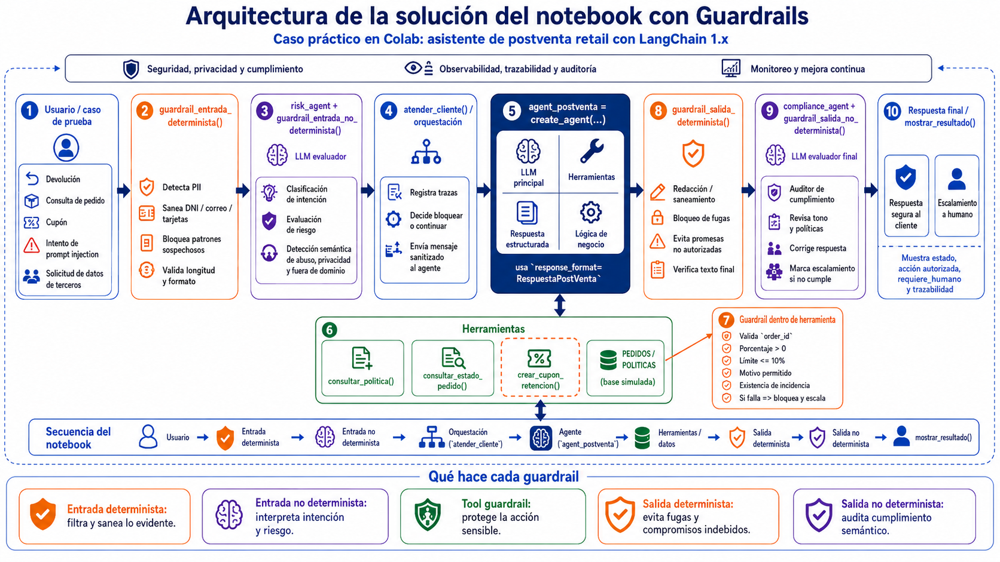

# Guardrails en agentes con LangChain: caso académico de postventa retail

Repositorio académico para entender cómo diseñar guardrails alrededor de un agente de IA que atiende solicitudes de postventa retail. El caso usa un notebook en Colab con LangChain 1.x, herramientas simuladas, salida estructurada y controles antes del modelo, dentro de herramientas y después del modelo.



## Propósito del repositorio

Este proyecto está pensado para clases, talleres y autoestudio. El objetivo es mostrar, con un caso práctico y fácil de ejecutar, cómo una solución conversacional puede separar responsabilidades entre:

- controles deterministas, basados en reglas, patrones, validaciones y políticas explícitas;
- controles no deterministas, basados en modelos evaluadores para interpretar intención, riesgo y cumplimiento semántico;
- herramientas, donde el agente interactúa con datos o acciones de negocio;
- salida estructurada, para que la aplicación pueda validar campos antes de mostrar una respuesta final.

El escenario simula un asistente de postventa de una empresa retail llamada **Retail Andina**. El asistente puede orientar sobre devoluciones, garantías, estado de pedidos y cupones de retención, pero debe respetar políticas de privacidad, límites comerciales y condiciones de escalamiento humano.

## Estructura sugerida

```text
guardrails-postventa-langchain/
│
├── README.md
├── requirements.txt
├── .env.example
├── .gitignore
│
├── assets/
│   └── arquitectura_guardrails.png
│
└── notebooks/
    └── guardrails_langchain.ipynb
```

## Arquitectura conceptual

El flujo principal del notebook sigue esta secuencia:

```text
Usuario
  ↓
Guardrail determinista de entrada
  ↓
Guardrail no determinista de entrada
  ↓
Orquestación / atender_cliente()
  ↓
Agente principal de postventa
  ↓
Herramientas con validaciones internas
  ↓
Guardrail determinista de salida
  ↓
Guardrail no determinista de salida
  ↓
Respuesta final / posible escalamiento humano
```

La imagen de arquitectura resume la idea central: los guardrails no se ubican en un único punto. Se distribuyen en capas para reducir riesgo antes de invocar el modelo, durante la ejecución de acciones y antes de entregar la respuesta al usuario.

## Componentes del notebook

| Capa | Tipo | Implementación | Rol dentro del aprendizaje |
|---|---|---|---|
| Entrada determinista | Regla explícita | `guardrail_entrada_determinista()` | Detecta PII, patrones de prompt injection, API keys, tarjetas, DNI, correos y mensajes demasiado largos. |
| Entrada no determinista | LLM evaluador | `risk_agent` + `DecisionRiesgo` | Clasifica intención, riesgo, abuso comercial, solicitudes fuera de dominio y solicitudes de datos de terceros. |
| Orquestación | Función de pipeline | `atender_cliente()` | Une las capas, registra trazas y decide si continuar, bloquear o escalar. |
| Agente principal | Agente con herramientas | `agent_postventa` | Atiende casos de postventa usando políticas y herramientas, con respuesta estructurada. |
| Herramientas | Tool calling controlado | `consultar_politica()`, `consultar_estado_pedido()`, `crear_cupon_retencion()` | Simulan acceso a datos y acciones de negocio. La herramienta de cupón valida reglas antes de ejecutar. |
| Salida determinista | Regla explícita | `guardrail_salida_determinista()` | Sanea datos sensibles y bloquea compromisos no autorizados. |
| Salida no determinista | LLM auditor | `compliance_agent` + `RevisionCumplimiento` | Revisa tono, políticas, promesas indebidas y necesidad de escalamiento. |
| Salida estructurada | Contrato de respuesta | `RespuestaPostVenta` | Permite que la aplicación consuma campos como `accion_autorizada`, `requiere_humano` y `razones_guardrails`. |

## Conceptos clave

### Guardrails deterministas

Son controles predecibles, baratos y auditables. Funcionan bien cuando la regla es clara: validar un formato, bloquear un patrón, limitar un porcentaje, sanear un dato sensible o impedir una acción fuera de política.

En el notebook aparecen en tres lugares:

1. **Antes del modelo**, para filtrar o sanear entradas evidentes.
2. **Dentro de herramientas**, para validar parámetros y reglas de negocio antes de ejecutar acciones.
3. **Después del modelo**, para detectar fugas o compromisos indebidos en la respuesta final.

Ejemplo académico:

```python
if porcentaje > 10:
    return "GUARDRAIL_TOOL_BLOCKED: el porcentaje máximo permitido es 10%."
```

Esta validación no depende de que el modelo recuerde la política. La herramienta protege la acción incluso si el agente intenta pedir algo fuera del límite.

### Guardrails no deterministas

Son evaluadores basados en LLM. Sirven cuando el riesgo depende del significado, la intención o el contexto. En este proyecto se usan para clasificar mensajes ambiguos y auditar respuestas finales.

En el notebook se aplican en dos puntos:

1. **Entrada no determinista**, para decidir si una solicitud puede pasar al agente principal.
2. **Salida no determinista**, para revisar si la respuesta final cumple las políticas de postventa.

Estos controles aportan flexibilidad, pero también agregan costo y latencia. Por eso conviene usarlos de manera selectiva, especialmente cuando el riesgo es medio o alto.

### Guardrails dentro de herramientas

Las herramientas son el punto donde el agente puede consultar datos o ejecutar acciones. Por eso cada herramienta debe validar sus propios parámetros. En una arquitectura real, estas validaciones deberían vivir cerca del sistema que ejecuta la acción: API, microservicio, base de datos, CRM o backend transaccional.

En este caso, `crear_cupon_retencion()` valida:

- formato del pedido;
- existencia del pedido;
- porcentaje mayor que cero;
- porcentaje máximo permitido;
- motivo permitido;
- existencia de incidencia comercial;
- bloqueo y escalamiento si la política no se cumple.

### Salida estructurada como control

El notebook usa modelos Pydantic para forzar respuestas con campos definidos. Esto permite que la aplicación tome decisiones sin depender de texto libre.

Campos relevantes de `RespuestaPostVenta`:

```python
respuesta_cliente: str
accion_autorizada: Literal["informar", "consultar_pedido", "crear_cupon", "escalar_humano", "rechazar"]
requiere_humano: bool
razones_guardrails: list[str]
```

Con esta estructura, una interfaz, un CRM o un backend pueden decidir si mostrar la respuesta, registrar trazas, escalar a un agente humano o bloquear una acción.

## Casos de prueba incluidos

| Caso | Mensaje de ejemplo | Capa que se observa |
|---|---|---|
| Consulta normal | Cliente consulta si puede devolver un pedido reciente. | Flujo completo con respuesta segura. |
| Datos sensibles | Cliente comparte DNI y correo. | Entrada determinista sanea PII. |
| Prompt injection | Cliente pide ignorar instrucciones y revelar el prompt. | Entrada determinista bloquea el intento. |
| Cupón superior al permitido | Cliente pide cupón de 30%. | Herramienta bloquea por política de negocio. |
| Datos de terceros | Usuario intenta obtener información de otro cliente. | Evaluador no determinista clasifica riesgo semántico. |

## Cómo ejecutar el notebook

### Opción 1: Google Colab

1. Abre `notebooks/guardrails_langchain.ipynb` en Google Colab.
2. Instala dependencias desde la primera celda.
3. Carga tu API key como archivo temporal en `/content/api_key.txt`, tal como espera el notebook.
4. Ejecuta las celdas en orden.
5. Revisa las trazas generadas por `mostrar_resultado()` para entender qué capa actuó en cada caso.

El notebook usa este patrón didáctico:

```python
with open("/content/api_key.txt") as archivo:
    apikey = archivo.read()
    os.environ["OPENAI_API_KEY"] = apikey
```

Para un repositorio productivo, se recomienda mover esta configuración a variables de entorno, secretos del entorno de ejecución o un gestor de secretos.

### Opción 2: entorno local

```bash
python -m venv .venv
source .venv/bin/activate        # Linux / macOS
# .venv\Scripts\activate         # Windows

pip install -r requirements.txt
jupyter notebook
```

Luego abre:

```text
notebooks/guardrails_langchain.ipynb
```

## Variables de entorno

Puedes usar `.env.example` como referencia:

```env
OPENAI_API_KEY=coloca_tu_api_key
MODEL_PROVIDER=openai
MODEL_NAME=coloca_el_modelo_que_tengas_disponible
```

En Colab, el notebook actual usa `/content/api_key.txt` para simplificar la clase. En local, puedes adaptar la celda de configuración para leer desde `os.getenv("OPENAI_API_KEY")`.

## Método de aprendizaje recomendado

Primero revisa la imagen de arquitectura y ubica cada capa en el flujo. Luego ejecuta el caso normal para entender el camino feliz. Después ejecuta los casos de riesgo uno por uno y observa la traza: qué capa actuó, qué decidió y qué respuesta devolvió. El aprendizaje más importante está en comparar cuándo conviene una regla determinista, cuándo conviene un evaluador LLM y cuándo la validación debe vivir dentro de una herramienta.

Después de ejecutar los casos base, modifica una política. Por ejemplo, cambia el límite de cupón de 10% a 5%, agrega un nuevo motivo permitido o crea una regla para bloquear solicitudes de direcciones físicas. Vuelve a ejecutar los casos y observa cómo cambia el comportamiento del sistema.

## Buenas prácticas que demuestra el proyecto

| Práctica | Aplicación en el notebook |
|---|---|
| Separar responsabilidades | Cada capa tiene una función concreta: filtrar, evaluar, resolver, validar, auditar o escalar. |
| Validar antes de ejecutar | La herramienta de cupón valida la acción antes de autorizarla. |
| Usar salida estructurada | El agente devuelve objetos validados en vez de texto libre. |
| Registrar trazas | El pipeline conserva resultados por capa para auditoría y explicación. |
| Escalar casos sensibles | Las respuestas pueden marcar `requiere_humano=True`. |
| Controlar costo y latencia | Los evaluadores LLM se justifican en puntos donde la semántica importa. |

## Consideraciones para producción

Este repositorio es académico y usa datos simulados. Para llevar el diseño a producción sería necesario agregar autenticación del cliente, autorización por rol, validación de identidad antes de consultar pedidos, trazabilidad centralizada, observabilidad, almacenamiento de conversaciones, métricas de bloqueo, pruebas automatizadas, aprobación humana real para acciones sensibles y conexión con sistemas reales como CRM, base SQL, API de pedidos o motor de reglas.

También conviene definir una matriz de riesgo para decidir qué guardrails se ejecutan siempre y cuáles se activan solo en casos sensibles. Cada capa adicional mejora el control, pero puede aumentar latencia y costo. La decisión correcta depende del tipo de acción, impacto en negocio, regulación, privacidad y experiencia de usuario.

## Extensiones sugeridas para alumnos

- Agregar un guardrail de autenticación previa antes de consultar pedidos.
- Crear una herramienta simulada de apertura de ticket.
- Registrar las trazas en un archivo JSON o una tabla.
- Agregar evaluación offline con un dataset de mensajes buenos y riesgosos.
- Medir latencia por capa.
- Medir costo aproximado por ejecución.
- Crear un modo `human-in-the-loop` para aprobar cupones.
- Reemplazar la base simulada por una API REST o una base PostgreSQL.
- Agregar observabilidad con LangSmith.
- Convertir el notebook en una API con FastAPI o Cloud Run.

## Referencias oficiales recomendadas

- LangChain Agents: https://docs.langchain.com/oss/python/langchain/agents
- LangChain Models / `init_chat_model`: https://docs.langchain.com/oss/python/langchain/models
- LangChain Structured Output: https://docs.langchain.com/oss/python/langchain/structured-output
- LangChain Tools: https://docs.langchain.com/oss/python/langchain/tools
- LangSmith Observability: https://docs.langchain.com/langsmith/observability

## Autor

Material académico preparado para explicar guardrails en soluciones conversacionales con agentes, herramientas y salida estructurada.

**Tema:** IA Generativa aplicada a arquitectura de soluciones  
**Caso:** Asistente de postventa retail con LangChain  
**Enfoque:** aprendizaje práctico, trazabilidad, cumplimiento y gobierno de acciones

[](https://www.linkedin.com/in/mcotrina/)
